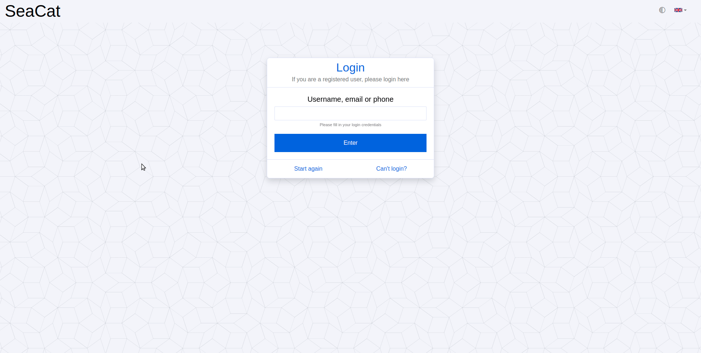
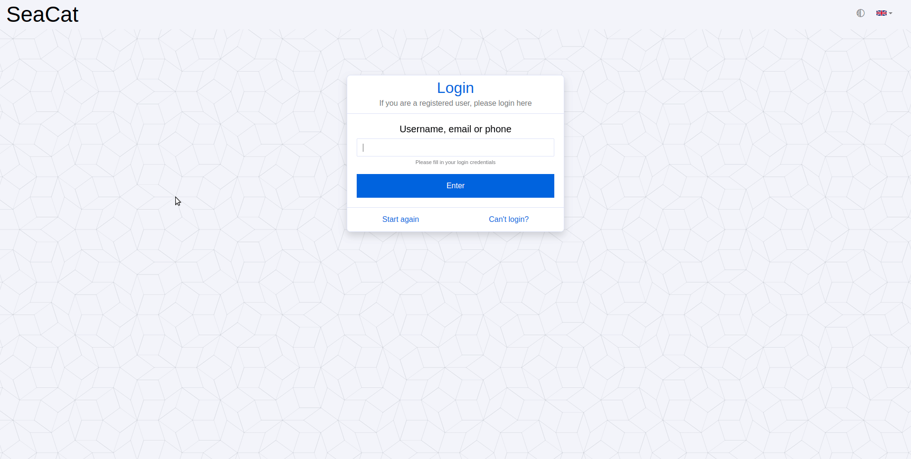
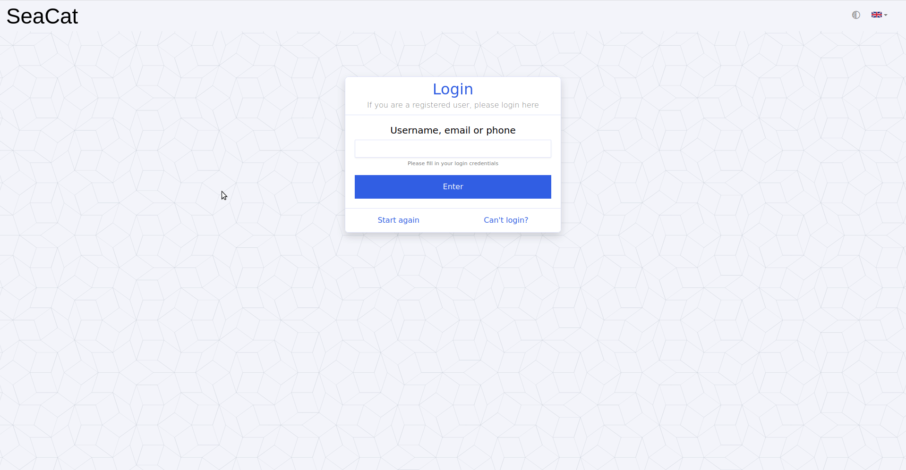

# SeaCat Auth WebUI

SeaCat Auth WebUI provides a login and self-care portal for users as a superstructure for [SeaCat Auth](https://github.com/TeskaLabs/seacat-auth).

## Password login



## Passwordless login



## FIDO2/WebAuthn registration



## Dependencies

### SeaCat Auth service

Information about how to setup [SeaCat Auth service](https://github.com/TeskaLabs/seacat-auth) can be found here: https://github.com/TeskaLabs/seacat-auth

## Clone SeaCat Auth WebUI

```
$ git clone https://github.com/TeskaLabs/seacat-auth-webui
$ cd seacat-auth-webui
```

## Prerequisities

## Installation

Install all necessary dependecies

```
$ pnpm install
```

## Start in dev environment

Run application in dev environment

```
$ pnpm start
```

## Build to production or build environment

```
$ pnpm build
```
