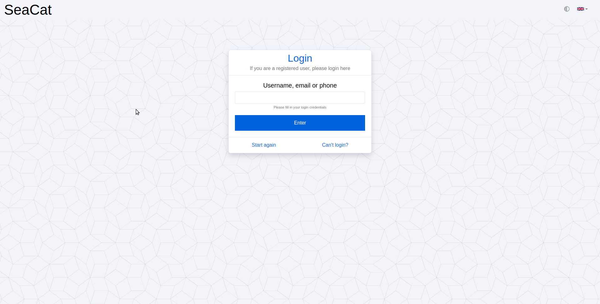

# SeaCat Auth WebUI

SeaCat Auth WebUI is a frontend login and user management application created as a superstructure for [SeaCat Auth service](https://github.com/TeskaLabs/seacat-auth).

## Password login


## Passwordless login


## FIDO2/WebAuthn registration



## Dependencies

### SeaCat Auth service

Information about how to setup [SeaCat Auth service](https://github.com/TeskaLabs/seacat-auth) can be found here: https://github.com/TeskaLabs/seacat-auth

## Clone SeaCat Auth WebUI

```
$ git clone https://github.com/TeskaLabs/seacat-auth-webui
$ cd seacat-auth-webui
```

## Prerequisities

### Initiate ASAB-WebUI submodule

`asab-webui` must be pulled so that can be referenced from the UI project.

```
$ git submodule update --init --recursive
```

## Installation

Install all necessary dependecies

```
$ yarn install
```

## Start in dev environment

Run application in dev environment

```
$ yarn start -c conf/conf.js
```

## Build to production or build environment

```
$ yarn build
```
